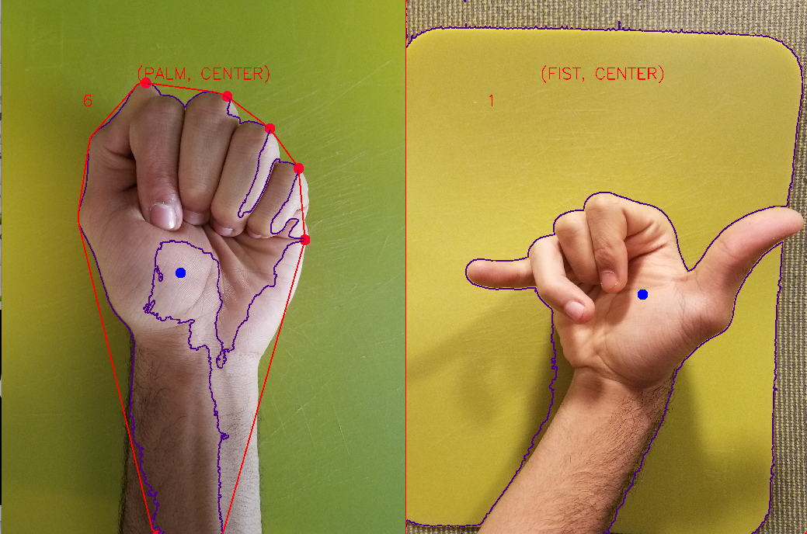

**HAND GESTURE RECOGNITION**

A program which will take as its input a sequence of images of either a fist or a palm and then produce from such sequence an instruction to the computer. The process involves capturing at least two different images with clear backgrounds and then inputting them into the software. The software will then proceed to do a few image editing procedures to pick out the skin color from the images, which is then captured and contoured. Once we obtain a contour, we can then find defects as well as the center of mass hand, which allows the program to determine the “what and where” of the hand respectively. After that, the program is able to check whether or not the combination of the “what and where” for the two pictures is part of a specified grammar; if it is, an instruction is logged to the console.

**DOMAIN ENGINEERING**

The first step of this process is to obtain a sequence of images. 

The images are best taken against any solid background color in order to prevent noise and confusion.

To improve results even further, I recommend taking the pictures against a green background as well as wearing green sleeves such as the picture above.

The color green is chosen as it is not similar to any natural skin tone or hair color, therefore it will be easier to pick out the skin tones in later image processing.

In this project, the 34 images are taken from a top-down view with non-direct lighting coming directly from the top in order prevent shadows from causing noise and confusion. 21 of the images are taken using a Samsung Galaxy s7 Edge at the lowest resolution of 2160x2160 pixels. The pictures are then saved as a compressed jpeg file and then transferred to Google Drive at which point they are further compressed to the resolution of 1600x1600 pixels to maximize processing speed. The other 13 images were taken at the high resolution of 4032x3024 pixel and saved as jpeg files for experimental purposes. The images were intended to capture the user with grabbing and moving items from the center of the screen to areas around the screen.

The naming convention for the images goes as follows:

The image can start with “f”, “p”, or “r” for fist, palm, or random respectively and end with a number denoting what quadrant of the screen (up to 9 quadrants) an image is meant to be in, unless the image starts with “r”, then the number after it is only there to uniquely identify it.

In order to further maximize image processing speed, the software was built using the latest version of OpenCV (3.4.0), and written in the low level language of C++ on a lightweight Linux operating system.

**DATA REDUCTION STEP**

In order to determine the “what and where” of the images, the images are manipulated in various ways to obtain a binary threshold of the skin color.

First and foremost, the image is converted from the Red Green Blue color space to the Hue, Value, Saturation color space.

         →        

                Original                     HSV

Secondly, an image mask is picked out using a threshold range of skin color.

In order to find the best possible combination for the range, a second program named “calibration” is used which allows the user to use trackbars to update the range in real time. Once a desired combination is found, the values can then be hard coded in the hand\_gesture\_regognition program. 

      →        

                HSV                           Threshold

The next few steps were done in order to reduce noise as well as refine the edges of the mask.

→ 

                 Threshold                    Eroded

→ 

                Dilated                      Blurred

At this point, the image is a good binary image of the hand (fist or palm).

The next step is to find all of the contours in the image and pick out the largest contour which is the hand in its entirety.

From this, we obtain the following

With the contour obtain, the next step is to calculate the convex hull. (See code)

The convex hull is very useful as the finger tips tend to be at the corners of the hull.

The first corner tends to be wrong, so I deliberately skip it.

Using the contour and the convex hull. We can detect the defects, which are essentially valleys, or dips between the corners of the hull and the contour.

After obtaining these triangular dips, we can pick out the fingers by only accounting for dips which are within a specified angle range; In this case, we only account for defects that are greater than 11500 units.

At this point, with some degree of precision, we are able to determine how many fingers are present. Unfortunately, this method is not perfect, for instance it may detect one finger for a fist, therefore if we count one finger or less, we can assume that the image is a fist, otherwise we assume that it is a palm. This adjustment makes the program very accurate at distinguishing between a palm and a fist.

Now that we have the “what” of the image, the next step is to obtain the “where”.

This is achieved by finding the center of area of the largest contour using moments and then comparing it to its relative position on the image canvas.

In order to be able to make the comparison we must first define areas on the canvas.

I’ve decided to split the image into 9 quadrants in the following way:

This is achieved by individually dividing the width and height by three to obtain the size of a quadrant.

With defined regions, the “where” is then determined by checking the center of area with the regions above.

**PARSING & PERFORMANCE**

The program takes in two images, and determines if the meaning of the sequence is valid. If it is, an instruction is sent to the computer. The grammar or accepted sequences are as follows:

| **Frame1**        | **Frame2**        | **Result**  |
| ------------- |:-------------:| -----:|
|(Palm, Center)|(Fist, Center)| SELECTED
|(Fist, Center)|(Palm, Center)|CANCELLED
|(Fist, Center)|(Palm, Center)|MOVED TO UPPER LEFT
|(Fist, Center)|(Palm, Center)|MOVED TO UPPER MIDDLE
|(Fist, Center)|(Palm, Center)|MOVED TO UPPER RIGHT
|(Fist, Center)|(Palm, Center)|MOVED TO LEFT
|(Fist, Center)|(Palm, Center)|MOVED TO RIGHT
|(Fist, Center)|(Palm, Center)|MOVED TO LOWER LEFT
|(Fist, Center)|(Palm, Center)|MOVED TO LOWER MIDDLE
|(Fist, Center)|(Palm, Center)|MOVED TO LOWER RIGHT
|Anything else|Anything else|UNKNOWN

(Palm, Center) to (Fist, Center) is chosen as the sequence for select because it is natural for the user to want to close their fist in order to grab an item on the screen and to open their fist in the center if they would like to cancel the operation. After selecting, all other operations must start with the fist in the center followed by an open palm anywhere else. This allows the user to feel as if they are physically grabbing an item in the center of the screen and then releasing it somewhere on the screen. Since the system is only active after the user has selected an item in the center of the screen, this allows the user to be able to relax and remain in  a resting position if they are not engaging with the program in a live situation. By default, humans keep their hands in a half closed position, which means that program is likely to only accept sequences that the user is actually trying to convey. The center of screen is chosen because the user’s hands will spend most its time around the lower ends of the canvas, therefore we avoid the problem of having a “midas hand” and prevent accidental uses of program.

**Successful Runs**

Program Output: SELECTED

Program Output: CANCELLED

Program Output: MOVED TO UPPER LEFT

Program Output: MOVED TO LEFT

Program Output: MOVED TO RIGHT

Program Output: MOVED TO LOWER MIDDLE

Program Output: MOVED TO LOWER RIGHT

Program Output: UNKNOWN

**False Positive**

Program Output: SELECTED

Program Output: SELECTED

The previous two examples outputted SELECTED even though they should have been UNKNOWN. The error in the first sequence occurred because the first image was lit from the side, hence confusing the program and messing up the contour. The chosen pictures also have a really large resolution of 4032x3024 pixel which made the program think that the defects are fingers, five of them to be exact. Using lower resolution images and better lighting would fix this issue in my opinion.

The second sequence is incorrect, because the user used the “thumbs-up” gesture, which is not part of the grammar, however, the program picked it up as a palm. This is because the program computed two fingers and assumed that it is a palm. This issue could be fixed that making 5 fingers the only accepted definition for a palm. This is also a human error and could have been fixed by following the grammar.

**False Negatives**

Program Output: UNKNOWN

Program Output: UNKNOWN

The previous examples should have outputted MOVED TO UPPER MIDDLE and MOVED TO UPPER RIGHT respectively, however the program assumed that they both failed because because the user moved his hand way to far up and ended up moving his fingers out of the frame, making it difficult for the program to compute the convex hull. Therefore, to fix this issue, the entire hand should be captured in all images.

**ENHANCEMENTS**

To further improve and enhance the system, I have chosen to make the system real time.

This was done by opening the camera and doing a cycle of 4 frames.

At frame1, the first image in the sequence is processed, at frame2 the system waits a 1000 millisecond which not only allows the user to switch his/her pose, but also allows for slower systems to process the images. At frame3, the second image of the sequence is processed, then the grammar is evaluated. Lastly, at frame4, the system waits another 1000 milliseconds to allow the user to switch his/her pose.

**LIVE MODE EXAMPLES**

Action: CANCELLED

Action: SELECTED

Action: UNKNOWN

Action: CANCELED

Action: SELECTED

Action: CANCELLED

Action: UNKNOWN

Action: UNKNOWN

**FALSE POSITIVES**

**FALSE NEGATIVES**

The live version the the program works, however it was hard to find a sweet spot with the amount of time between each frame. If the time is to fast then the user does not have the time to change gestures, and if it is too slow then the system feels slow and bulky. Due to these difficulties if was hard to be able to display all of the systems grammar in the live version. Lighting proved to be an issue as well. When dealing with the video frames, it was harder to get the light to fall in such a way so that shadows and reflections would not interfere with the image processing.

To reduce these issues, I could have used a tripod to stabilize the camera, as well as used a large still background, preferably green.  Lastly, I could have also worn a long green sleeved t-shirt and covered my face to not confuse the program.

Pictures used are in pictures folder.
